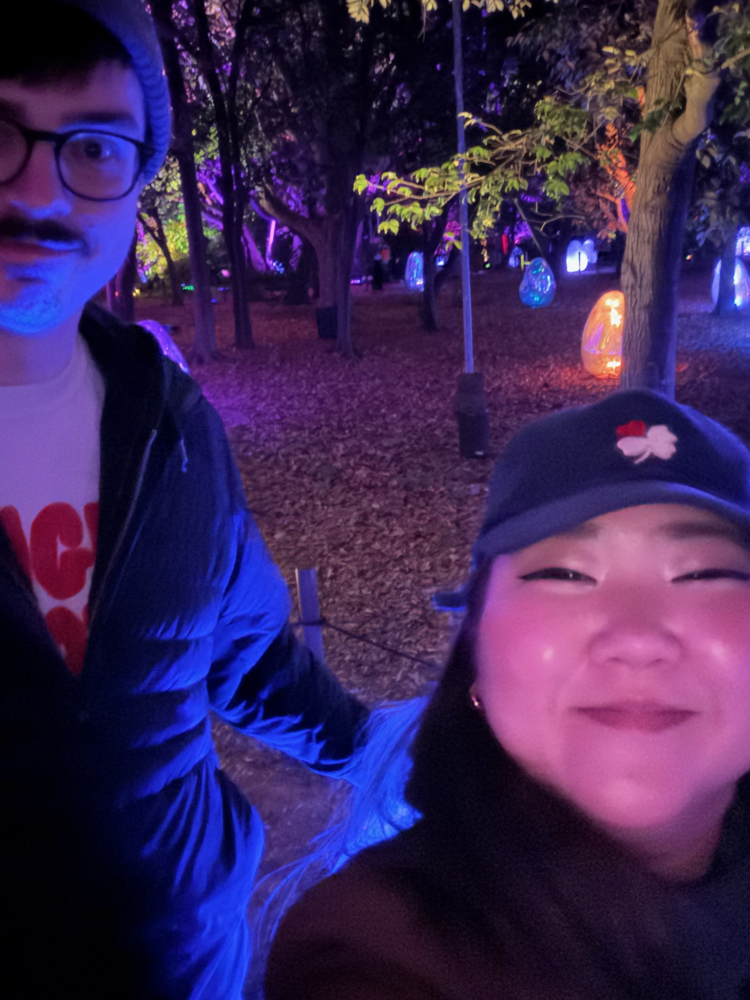
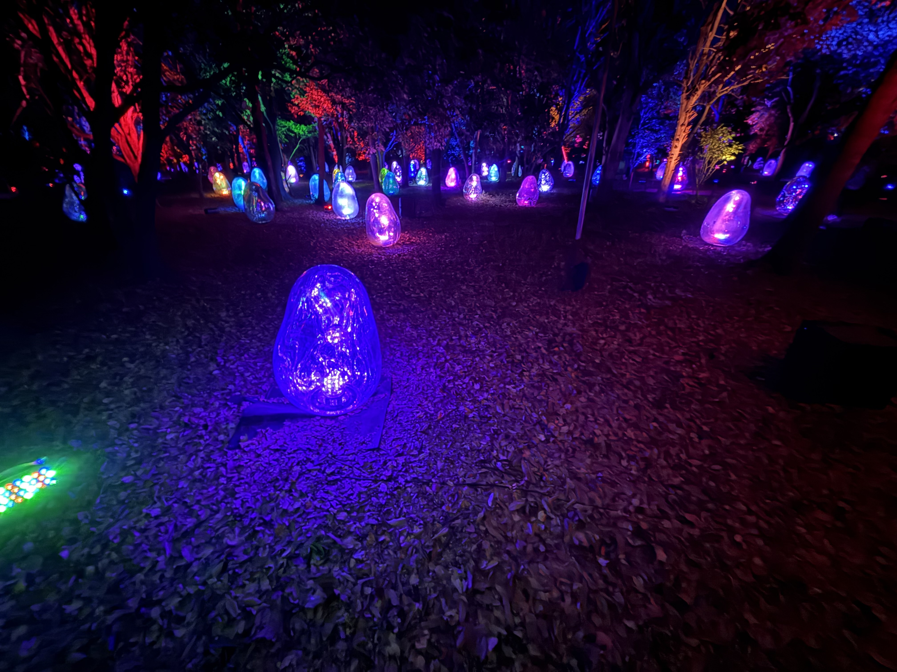

If you’re visiting Osaka I would highly recommend a trip to the teamLab exhibit at the Nagai Botanical Garden.

This was right up my alley, featuring all sorts of interactive LED lights synchronized to music.  On top of that, many of the features were interactive; when you touch an element it would make a sound and the colour would change, and then the sounds and colours would radiated out to neighbouring elements.

The pièce de résistance was this crazy inflated tube thing — I’ve never seen anything like it. 

<video width=“100%” controls playsinline>
  <source src=“teamlab.mp4” type=“video/mp4”>
</video>